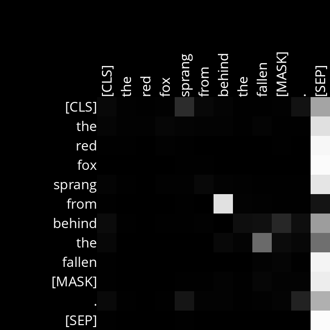
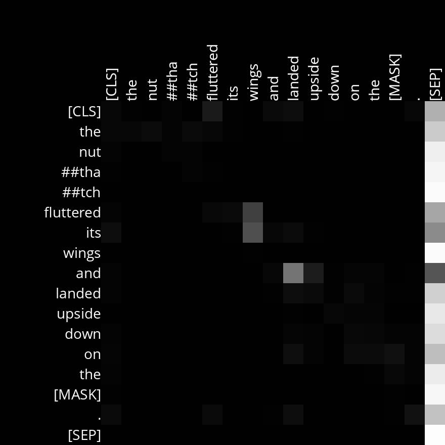
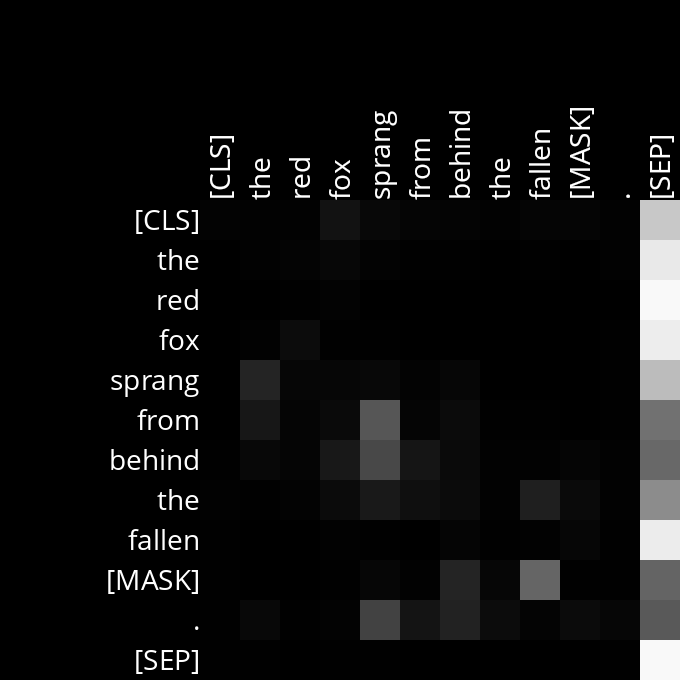
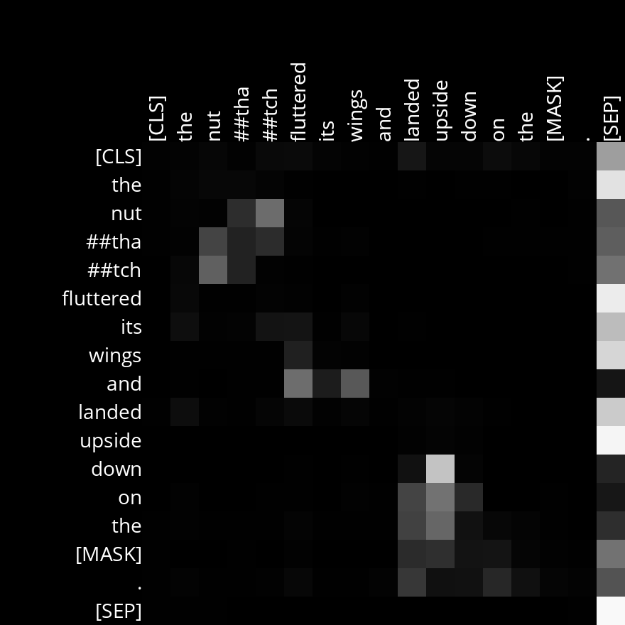
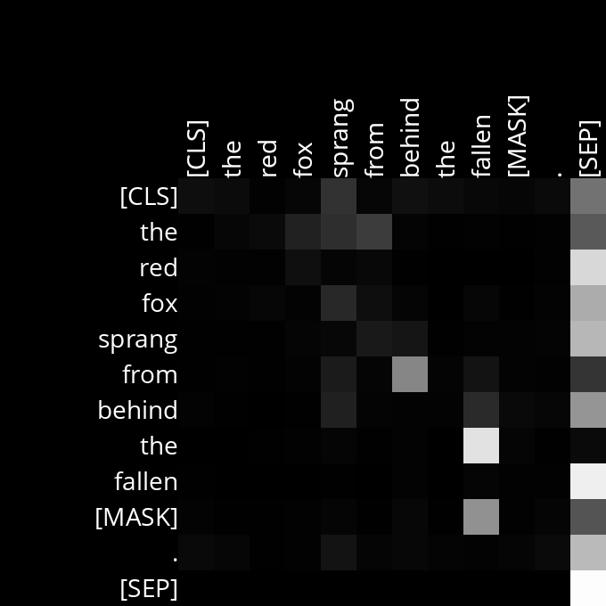
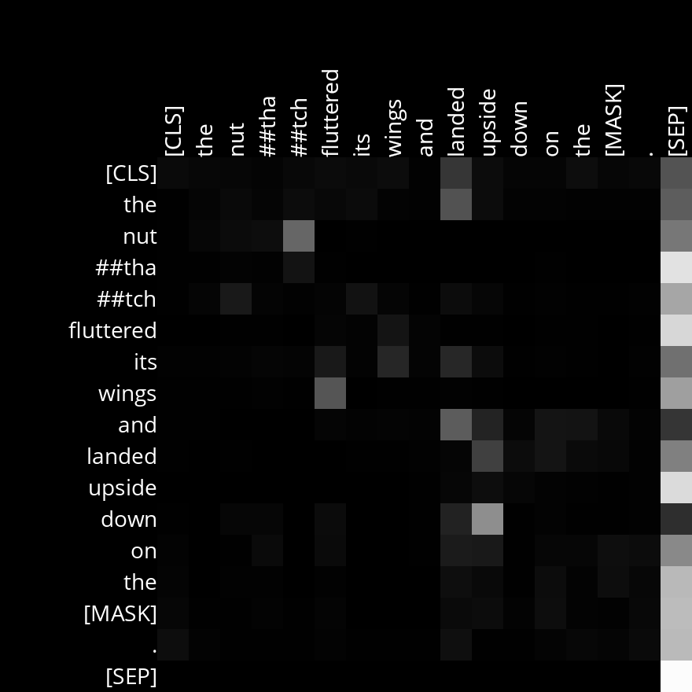
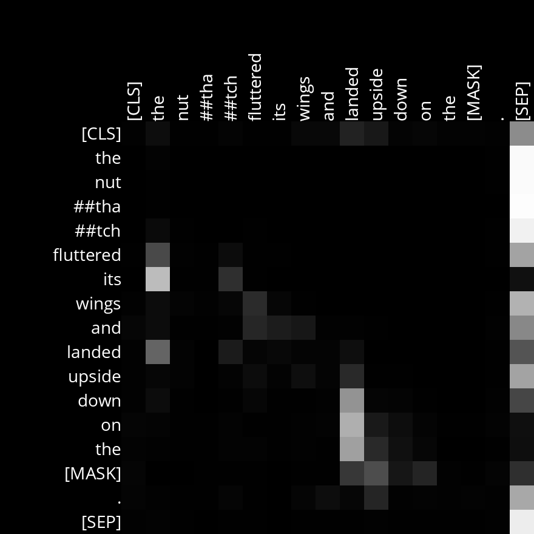
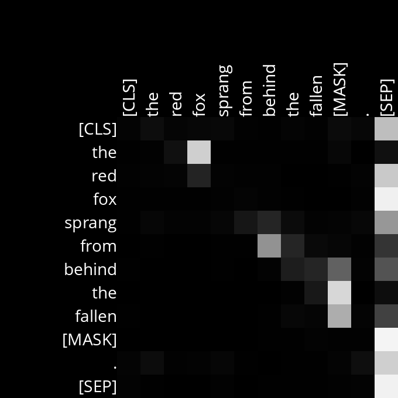
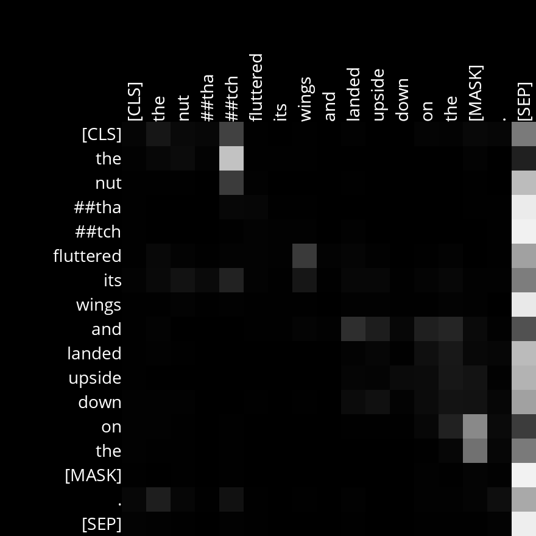

# Analysis

## Visualizations of interest

Attention_Layer6_Head8.png
|   |  |
|:-----------------------------------------------------:|:-----------------------------------------------------:|
Attention_Layer7_Head5.png
|  |  |
|:-----------------------------------------------------:|:-----------------------------------------------------:|
Attention_Layer7_Head6.png
|  |  |
|:-----------------------------------------------------:|:-----------------------------------------------------:|
Attention_Layer7_Head11.png
|  |  |
|:-----------------------------------------------------:|:-----------------------------------------------------:|
<!--Attention_Layer8_Head11.png
|  |  |
|:-----------------------------------------------------:|:-----------------------------------------------------:|
-->

## Layer 8, Head 11

In this layer the attention heads are focused on the determiner (D) and noun (N).  In sentence 1, the fox; and in 2, the nutthatch (which it has broken into more than one token).

Example Sentences:
- The red fox sprang from behind the fallen [MASK]
- The nutthatch fluttered its wings and landed upside down on the [MASK]

## Layer 7, Head 11

This one is an interesting one in sentence 2 its paying attention to the relationship between "fluttered its" and the phrase "down on the" with the highest attention on "on" the preposition and "landed" a verb.  On sentence 1 the attention is equally complex falls on a cluster "sprang from behind" and the [MASK] and "behind"

Example Sentences:
- The red fox sprang from behind the fallen [MASK]
- The nutthatch fluttered its wings and landed upside down on the [MASK]
